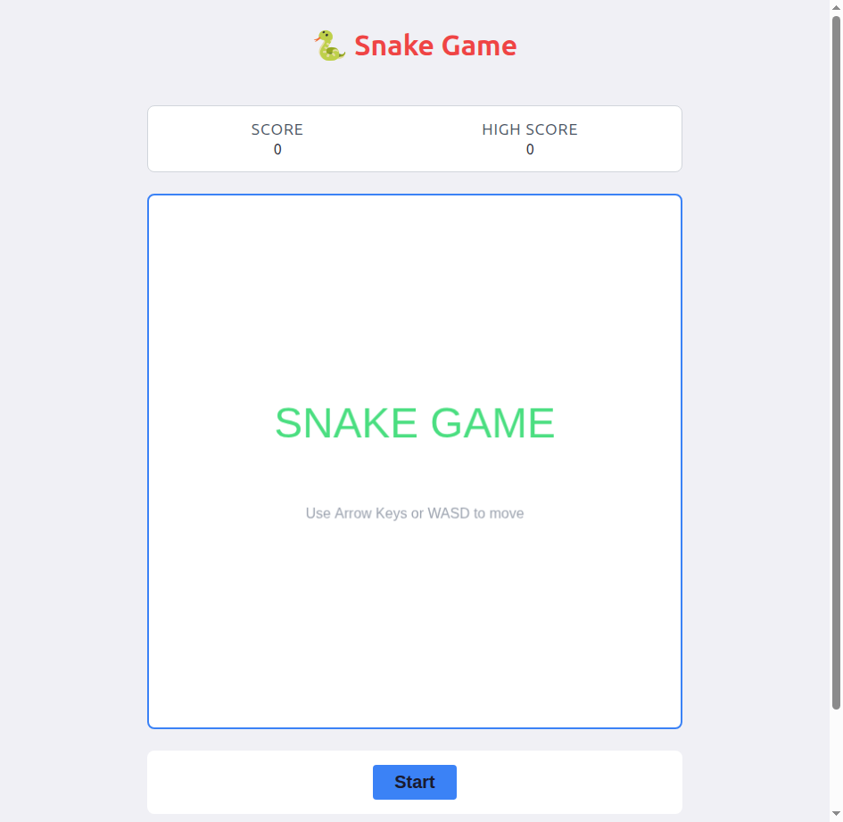
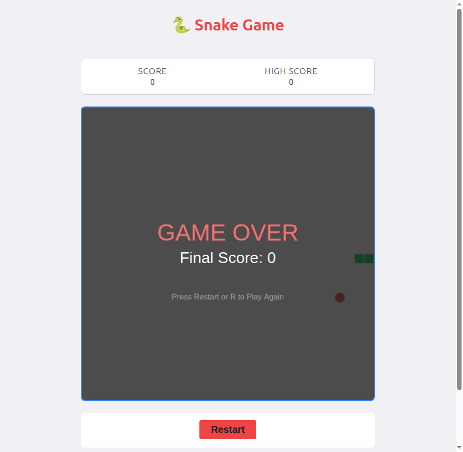
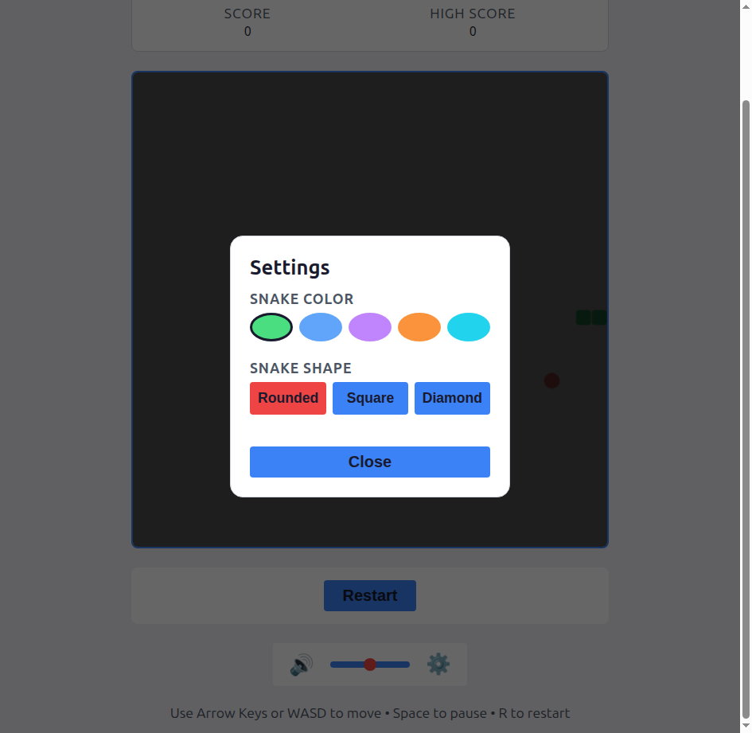

# Snake Game

A classic snake game built with TypeScript, featuring responsive design, sound effects, touch controls, offline support, customizable snake appearance, and local score persistence.

> **Note**: This project was built for fun using the **GLM 5.0 LLM model** inside [Claude Code](https://docs.anthropic.com/en/docs/claude-code) with the [MoAI-ADK](https://github.com/moai-adk) orchestration framework. The entire codebase — game engine, UI, tests, and visual polish — was generated through AI-assisted pair programming, not hand-written.

## Screenshots

### Menu Screen



### Gameplay



### Settings Panel



## Features

- **Classic Snake Gameplay**: Navigate the snake to eat food and grow longer
- **Progressive Difficulty**: Speed increases as you score more points
- **Customizable Appearance**: Choose from 5 snake colors (Green, Blue, Purple, Orange, Cyan) and 3 shapes (Rounded, Square, Diamond) via the settings panel
- **Touch Controls**: Swipe to change direction on mobile devices
- **Score System**: Track current score and high score with persistent storage
- **Sound Effects**: Procedurally generated audio using Web Audio API
- **Responsive Design**: Mobile-first layout that works on all screen sizes
- **Visual Polish**: Pulsing food, differentiated snake head with eyes, score popups, gold particle burst, screen shake
- **Keyboard Controls**: Arrow keys/WASD for direction, Space for pause, R to restart
- **Auto-Pause**: Game pauses automatically when you switch browser tabs
- **Offline Support**: Installable PWA with service worker caching
- **Accessible**: ARIA labels, skip navigation, screen reader support, reduced-motion support
- **Dual Theme**: Automatic dark/light theme via prefers-color-scheme

## Quick Start

```bash
# Install dependencies
bun install

# Start the dev server
bun run dev
```

Open [http://localhost:3000](http://localhost:3000) in your browser.

## Development

```bash
bun run dev          # Start dev server
bun test             # Run unit tests
bun run test:e2e     # Run E2E tests
bun run lint         # Lint code
bun run lint:fix     # Fix lint issues
bun run build        # Production build
bun run preview      # Preview production build
```

## Game Controls

| Input | Action |
|-------|--------|
| Arrow Keys / WASD | Change direction |
| Swipe (mobile) | Change direction |
| Tap canvas (mobile) | Start / Restart |
| Space | Pause / Resume |
| R | Restart |
| Esc | Return to menu |

## Project Structure

```
snake-game/
├── public/
│   ├── manifest.json       # PWA manifest
│   └── sw.js               # Service worker
├── src/
│   ├── game/               # Core game engine
│   │   ├── Snake.ts         # Snake entity with direction queue
│   │   ├── Food.ts          # Food system with rejection sampling
│   │   └── Renderer.ts      # Canvas 2D rendering with visual effects
│   ├── audio/
│   │   └── SoundManager.ts  # Procedural sound via Web Audio API
│   ├── storage/
│   │   ├── ScoreStorage.ts  # Score persistence with memory fallback
│   │   └── SettingsStorage.ts # Appearance settings (color, shape)
│   ├── ui/
│   │   ├── ScoreBoard.ts    # Score display component
│   │   ├── GameControls.ts  # Game button controls
│   │   ├── SoundControls.ts # Volume/mute controls
│   │   └── SettingsPanel.ts # Color and shape customization
│   ├── main.ts              # Entry point, game loop, visibility API
│   └── styles.css           # Responsive styles with dual theme
├── tests/
│   ├── unit/                # Unit tests (Bun Test)
│   └── e2e/                 # E2E tests (Playwright)
└── dist/                    # Production build output
```

## Technology Stack

| Technology | Version | Purpose |
|------------|---------|---------|
| TypeScript | 6.0+ | Type-safe development |
| Bun | 1.3+ | Runtime, package manager, test runner |
| Vite | 8.0+ | Build tool and dev server |
| Biome | 2.4+ | Linting and formatting |
| Playwright | 1.59+ | E2E testing |

## Quality Metrics

- **Tests**: 134 unit + 37 E2E passing
- **Lint**: Zero errors (Biome)
- **Build**: ~24 KB JS (~7.5 KB gzipped)
- **Offline**: Supported via service worker (cache-first static assets)
- **Themes**: Automatic dark/light mode via prefers-color-scheme
- **Compatibility**: Chrome 90+, Firefox 88+, Safari 14+, Edge 90+

## Browser Support

Chrome 90+, Firefox 88+, Safari 14+, Edge 90+

## License

MIT

## Author

Junguk Hur
